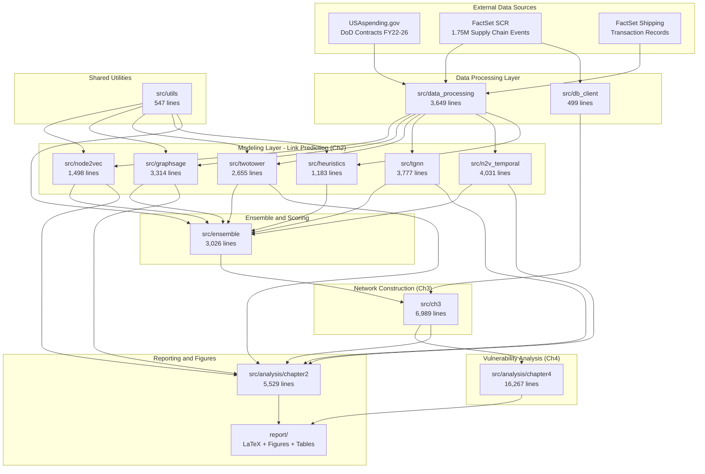
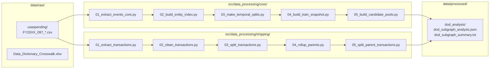
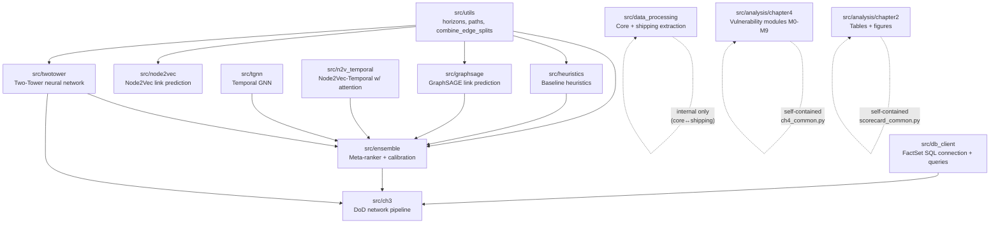

# PROJECT_MAP.md — Codebase Architecture & Dependency Guide

**Project:** Semiconductor Supply Chain Vulnerability Analysis
**Contract:** Cornell Brooks School Technology Policy Institute → ANAG LLC
**Statutory Authority:** 2024 NDAA §1513, Cooperative Agreement HQ00342520002
**Last Updated:** 2026-04-14

This document maps the complete project structure — Python codebase (53K lines), LaTeX report, and data pipeline — for onboarding, maintenance, and delivery verification. Generated using [pyan3](https://github.com/Technologicat/pyan) static analysis and manual review.

---

## Table of Contents

1. [High-Level Architecture](#1-high-level-architecture)
2. [Data Pipeline](#2-data-pipeline)
3. [Python Codebase](#3-python-codebase)
4. [Report Compilation](#4-report-compilation)
5. [Cross-Module Dependencies](#5-cross-module-dependencies)
6. [Module Reference](#6-module-reference)
7. [File Inventory](#7-file-inventory)
8. [Entry Points & Execution Order](#8-entry-points--execution-order)
9. [Key Artifacts & Outputs](#9-key-artifacts--outputs)
10. [Infrastructure & Environment](#10-infrastructure--environment)

---

## 1. High-Level Architecture

The project has three layers: **data processing**, **modeling & analysis**, and **reporting**. Data flows from raw government contract records through a multi-model link prediction pipeline into a vulnerability analysis framework, with results rendered as a LaTeX report.



---

## 2. Data Pipeline

### 2.1 Data Sources

| Source | Volume | Description |
|--------|--------|-------------|
| USAspending.gov | 16.2M transactions | DoD prime contract actions FY22-26, Agency Code 097 |
| FactSet Supply Chain Relationships (SCR) | 1.75M events, 325K firms | Disclosed buyer-supplier relationships |
| FactSet Shipping | Transaction-level | Observed shipping activity between firms |
| DAIMS Data Dictionary | 1 file | `Data_Dictionary_Crosswalk.xlsx` — schema for USAspending columns |

### 2.2 Pipeline Flow



### 2.3 Final Network Statistics

| Metric | Value |
|--------|-------|
| Total Entities (Nodes) | 78,257 (report) / 341,441 (full subgraph) |
| Total Edges | 340,445 directed (report) / 1,222,450 (full) |
| Tier-0 Components | 23 |
| Tier-1 Primes (Direct DoD Contractors) | 6,742 (report) / 22,139 (full) |
| Semiconductor Firms | 2,085 |
| Central Node | DOD_CENTRAL |
| Tier Distribution | T1: 22K, T2: 26K, T3: 197K, T4: 90K, T5: 5K, T6: 58 |

---

## 3. Python Codebase

### 3.1 Summary

| Metric | Value |
|--------|-------|
| Total Python files | 156 |
| Total lines of code | 55,948 |
| Top-level modules | 12 |
| External dependencies | torch, torch_geometric, networkx, scipy, pandas, numpy, matplotlib, sklearn |
| Execution environment | Original development server: 2x RTX 6000 Ada, 1TB RAM, 196 cores. Cornell should provision equivalent GPU compute to reproduce training results. |

### 3.2 Module Architecture

The codebase follows a **pipeline architecture** with five stages:

1. **Data Processing** (`data_processing/`, `db_client/`) — Extract, clean, split raw data into model-ready format
2. **Model Training & Evaluation** (`node2vec/`, `graphsage/`, `twotower/`, `tgnn/`, `n2v_temporal/`, `heuristics/`) — Six link prediction approaches
3. **Ensemble & Meta-Learning** (`ensemble/`) — Combine model outputs into calibrated predictions
4. **Network Construction** (`ch3/`) — Build the DoD-anchored supply chain network using predictions + USAspending
5. **Vulnerability Analysis** (`analysis/`) — Generate tables, figures, and run vulnerability modules

### 3.3 Module Dependency Graph

Cross-module import dependencies (verified by pyan3 static analysis):



**Key insight:** `src/utils/` is the foundational layer — `horizons.py` provides temporal split logic used by all model evaluators. `src/ensemble/` is the integration hub — it imports from all six model families to build the meta-dataset. `src/analysis/` modules are self-contained and depend only on their own common libraries.

---

## 4. Report Compilation

### 4.1 LaTeX Dependency Tree

The report compiles from `report_main.tex` (the **only** entry point). All paths include the `report/` prefix for Overleaf compatibility.

```mermaid
graph TD
    ROOT[report_main.tex<br/>188 lines, consulting format]

    subgraph Frontmatter
        COV[report/frontmatter/cover.tex]
        DIS[report/frontmatter/disclaimer.tex]
        EXEC[report/frontmatter/executive_summary.tex]
    end

    subgraph "Active Chapters"
        CH1[report/chapters/01_introduction.tex<br/>~13,245 words]
        CH2[report/chapters/02_methods_linkpred.tex<br/>~21,940 words]
        CH3T[report/chapters/03_dod_build_shipping_semiconductor.tex<br/>~12,956 words]
        CH4T[report/chapters/04_severity_scenarios.tex]
        CH5T[report/chapters/05_illumination_to_assurance.tex]
        CH6T[report/chapters/06_conclusion.tex]
    end

    subgraph Appendices
        APPA[report/appendix/appendixA.tex<br/>~1,574 words]
        APPB[report/appendix/appendixB.tex<br/>~682 words]
        APPC[report/appendix/appendixC.tex<br/>~1,210 words]
    end

    BIB[report/references.bib<br/>218 entries]

    ROOT --> COV & DIS & EXEC
    ROOT --> CH1 & CH2 & CH3T & CH4T & CH5T & CH6T
    ROOT --> APPA & APPB & APPC
    ROOT --> BIB
```



### 4.2 Figures & Tables

**Figures** (16 total, referenced via full relative paths in `\includegraphics`):

| Chapter | File | Format |
|---------|------|--------|
| Ch1 | fig_1.1_chip_production_chart.png | PNG |
| Ch1 | fig_1.2_wafer_manufacturing_process.png | PNG |
| Ch1 | fig_1.3_lithography.png | PNG |
| Ch1 | fig_1.4_global_journey.png | PNG |
| Ch1 | fig_1.5_sme_sales.png | PNG |
| Ch2 | fig_01_degree_histogram.pdf | PDF |
| Ch2 | fig_02_pr_curve_test.pdf | PDF |
| Ch2 | fig_03_precision_yield_frontier_test.pdf | PDF |
| Ch2 | fig_04_topk_floor_heatmap_recall_test.pdf | PDF |
| Ch3 | fig_3.1_tier_depth_profile.png | PNG |
| Ch4 | fig_4.1_robustness_observed.pdf | PDF |
| Ch4 | fig_4.2_schematic_corridor_vs_upstream.pdf | PDF |
| Ch4 | fig_4.3_mechanism_decomposition.pdf | PDF |
| Ch4 | fig_4.4_action_matrix.tex | TikZ |
| Ch4 | fig_4.5_case_study_network_observed.pdf | PDF |
| App C | fig_c_1_cross_view_overlap_curve.pdf | PDF |

**Tables** (18 total, via `\input{report/tables/...}`):

| Chapter | File | Content |
|---------|------|---------|
| Ch2 | tab_2.1_global_scorecard_test.tex | Model performance scorecard |
| Ch2 | tab_2.2_structural_generalization.tex | Structural slice results |
| Ch2 | tab_2.3_temporal_scorecard.tex | Temporal horizon results |
| Ch3 | tab_3.1_topk_precision_lift.tex | Top-K precision and lift |
| Ch3 | tab_3.2_table_deciles.tex | Decile analysis |
| Ch3 | tab_3.3_model_agreement_precision.tex | Cross-model agreement |
| Ch3 | tab_3.4_dod_semiconductor_network_summary.tex | Network summary statistics |
| Ch3 | tab_3.5_evidence_overlap_deltas.tex | Evidence type comparison |
| Ch4 | tab_4.1_budget-k_interdiction_performance_deny_vs_delay.tex | Budget-K interdiction performance |
| Ch4 | tab_4.2_strict_top25_observed.tex | Strict Top-25 chokepoint shortlist |
| Ch5 | tab_5_1_implementation_roadmap.tex | Implementation roadmap |
| App A | tab_a.1_global_scorecard_validation.tex | Validation scorecard |
| App A | tab_a.2_seed_robustness.tex | Seed robustness (mean ± 95% CI) |
| App A | tab_a.3_full_structural_slice_test.tex | Full structural slices (test) |
| App A | tab_a.4_full_structural_slice_val.tex | Full structural slices (validation) |
| App A | tab_a.5_full_temporal_table.tex | Full temporal horizons |
| App C | tab_c.1_crossview_stability_summary.tex | Cross-view stability summary |
| App C | tab_c.2_adjacent_uncertain_top25_empirical.tex | Adjacent uncertain Top-25 |

### 4.3 Figure Generation Pipeline

Code in `src/analysis/chapter2/` generates the Ch2 figures and tables. Code in `src/analysis/chapter4/` generates Ch4 outputs (figures, tables, and appendix assets).

```text
src/analysis/chapter2/fig_*.py  →  figs/chapter2/*.pdf
src/analysis/chapter2/tab_*.py  →  report/tables/tab_2.*.tex

src/analysis/chapter4/reporting/  →  report/figures/fig_4.*, report/tables/tab_4.*, report/tables/tab_c.*
```

Ch5 and Ch6 contain no code-generated figures. Ch5's single table (`tab_5_1_implementation_roadmap.tex`) was authored directly.

Note: `figs/` (organized by chapter, code-generated) and `report/figures/` (flat, LaTeX-referenced) contain overlapping content. LaTeX only reads from `report/figures/`.

---

## 5. Cross-Module Dependencies

### 5.1 Verified Import Edges (pyan3 static analysis)

| Source Module | Target Module | Specific Import |
|--------------|---------------|-----------------|
| `node2vec` | `utils` | `horizons` |
| `graphsage` | `utils` | `horizons` |
| `twotower` | `utils` | `horizons` |
| `heuristics` | `utils` | `horizons` |
| `ensemble` | `utils` | `horizons` |
| `ensemble` | `graphsage` | `run_graphsage_eval` |
| `ensemble` | `heuristics` | `run_heuristics_eval` |
| `ensemble` | `twotower` | `run_twotower_eval` |
| `ensemble` | `tgnn` | `run_tgnn_eval`, `model` |
| `ensemble` | `n2v_temporal` | `run_n2v_temporal_eval`, `model` |
| `ch3` | `db_client` | `connection` |
| `ch3` | `ensemble` | `build_meta_dataset`, `utils` |
| `ch3` | `twotower` | `run_twotower_eval` |
| `data_processing` | *(internal only)* | `core._common.run_utils`, `shipping.common` |
| `db_client` | *(internal only)* | `cli → query → connection` |
| `analysis/chapter2` | *(self-contained)* | `scorecard_common` |
| `analysis/chapter4` | *(self-contained)* | `ch4_common` |

### 5.2 External Dependencies

Core scientific stack (all required on execution server):

| Package | Used By | Purpose |
|---------|---------|---------|
| `torch` | node2vec, graphsage, twotower, tgnn, n2v_temporal | GPU-accelerated model training |
| `torch_geometric` | node2vec, graphsage, tgnn, n2v_temporal | Graph neural network layers |
| `networkx` | ch3, analysis/chapter4, data_processing | Graph construction and algorithms |
| `scipy` | analysis/chapter4, ensemble | Sparse matrices, statistics |
| `pandas` | all modules | DataFrame operations |
| `numpy` | all modules | Numerical computation |
| `matplotlib` | analysis/chapter2, analysis/chapter4 | Figure generation |
| `sklearn` | ensemble | Meta-learner training, calibration |

---

## 6. Module Reference

### 6.1 `src/data_processing/` (3,649 lines)

**Purpose:** Transform raw FactSet SCR and shipping data into model-ready edge lists with temporal splits.

| Submodule | Files | Role |
|-----------|-------|------|
| `core/` | 9 numbered scripts (00-08) + `build_structural_scalars.py` + `_common/` | Orchestrator (00), extract SCR events (01), entity index (02), temporal splits (03), train snapshots (04), candidate pools (05), features (06), validation (07), freeze (08) |
| `shipping/` | 5 numbered scripts + `common.py` | Extract shipping transactions → clean → split → parent rollup → parent splits |

**Entry points:** `core/00_run_core_pipeline.py` orchestrates the full core pipeline. Individual scripts (01-08) can also run independently in sequence. Each reads output from the previous step.

### 6.2 `src/node2vec/` (1,498 lines)

**Purpose:** Node2Vec-based link prediction. Learns node embeddings from graph random walks, then scores candidate edges by embedding similarity.

**Key files:** HPO scripts (`00_`, `01_`), training (`02_`, `03_`), evaluation (`run_node2vec_eval.py`).

### 6.3 `src/graphsage/` (3,314 lines)

**Purpose:** GraphSAGE link prediction. Uses neighborhood aggregation to learn inductive node representations.

**Key files:** HPO (`00_`, `01_`, `02_`), training/eval (`03_`, `run_graphsage_eval.py`), utilities (`graphsage_utils.py`).

### 6.4 `src/twotower/` (2,655 lines)

**Purpose:** Two-tower neural network for link prediction. Encodes source and target nodes independently, scores via dot product. Supports cold-start prediction for primes not in training graph.

**Key files:** HPO (`00_`, `01_`, `02_`), training/eval (`03_`, `run_twotower_eval.py`), cold-start finalize (`recreate_twotower_finalize.py`).

### 6.5 `src/tgnn/` (3,777 lines)

**Purpose:** Temporal Graph Neural Network. Incorporates temporal information directly into graph convolution layers, capturing how supply chain relationships evolve over time.

**Key files:** Model definition (`model.py`), training (`01_train_tgnn.py`), attention snapshotting, evaluation (`run_tgnn_eval.py`).

### 6.6 `src/n2v_temporal/` (4,031 lines)

**Purpose:** Node2Vec-Temporal with attention-based snapshot aggregation. Combines Node2Vec embeddings across multiple time snapshots using learned attention weights.

**Key files:** Model (`model.py`), training (`train.py`), snapshot management, evaluation (`run_n2v_temporal_eval.py`).

### 6.7 `src/heuristics/` (1,183 lines)

**Purpose:** Baseline heuristic link predictors (common neighbors, Jaccard, Adamic-Adar, preferential attachment). Establishes performance floor for ML models.

**Key files:** `run_heuristics_eval.py` (evaluator with integrated heuristic implementations, 1,183 lines).

### 6.8 `src/ensemble/` (3,026 lines)

**Purpose:** Meta-ranker that combines predictions from all six model families. Builds a meta-dataset of model scores, trains a stacking meta-learner, calibrates output probabilities, and exports final edge scores.

**Key files:**

- `build_meta_dataset.py` — Collects scores from all models
- `train_meta.py` — Trains stacking meta-learner
- `apply_meta.py` — Applies trained meta-model
- `calibration_plots.py` — Probability calibration
- `export_scores.py` — Exports final scores (imports from all 6 model evaluators)
- `eval_selection.py` — Model selection evaluation
- `evaluate_meta.py` — Meta-learner evaluation
- `threshold_eval.py` — Threshold analysis
- `ensemble_predict.sh` — Shell script for ensemble prediction
- `utils.py` — Shared ensemble utilities (imported by 7 other files)

### 6.9 `src/ch3/` (6,989 lines)

**Purpose:** Canonical DoD-anchored network construction pipeline. Uses USAspending contract data to build the Tier-1 prime contractor graph, augments with ensemble predictions for deeper tiers, applies semiconductor subgraph filtering.

**Submodules:**

- `network/` — Network construction: disclosed baseline, semiconductor subgraph, shipping observed layer, tier computation
- `matching/` — Prime contractor entity matching to FactSet universe
- `usaspending/` — USAspending data extraction and processing
- `prediction/` — Cold-start scoring, semiconductor catalog, metadata joining
- `analysis/` — Diagnostic scripts, tables, figures, multiplex network analysis
- `config/` — Semiconductor codes and timeline configuration

### 6.10 `src/analysis/chapter2/` (5,529 lines)

**Purpose:** Generate all figures and tables for Chapter 2 (link prediction methodology). Each script produces one figure or table file.

**Key shared library:** `scorecard_common.py` (877 lines) — Reusable evaluation framework used by all table/figure generators.

**Scripts follow naming convention:** `fig_NN_*.py` for figures, `tab_NN_*.py` for tables.

### 6.11 `src/analysis/chapter4/` (16,267 lines)

**Purpose:** Vulnerability and severity analysis. A modular pipeline of 10 analysis stages (M0-M9), each implemented as a separate module, governed by `chapter4_module_contract.md`.

**Core library:** `ch4_common.py` (500+ lines) — EntityGraph dataclass, UnionFind for identity collapse, PageRank/HITS/eigenvector centrality (power iteration), BFS reach/tier calculation, evidence weighting, sparse matrix utilities.

**Module system (M0-M9):**

| Module | Purpose |
|--------|---------|
| M0 | Graph contract — identity collapse via UnionFind, edge view validation |
| M0.5-M0.7 | Code universe, FactSet industry enrichment, semiconductor lens |
| M1 | Baseline topology per view (disclosed/observed/full) |
| M2 | Centrality, seam analysis (articulation/bridges), DoD harm scoring, hard chokepoints (dominators/min-cut) |
| M3 | DoD exposure, common-mode dependence, supplier-centric refinement, effective reach |
| M4 | Semiconductor-to-prime corridor importance, bottleneck refinement |
| M5 | Prime-level redundancy/substitution proxy |
| M6 | Disruption severity (weighted, stratified, guardrails, effective, prime profiles, mechanism decomposition) |
| M7 | Cross-view stability and confidence classification |
| M8 | Semi-centric upstream disruption |
| M9 | Post-analysis semantic lens (aliases M0.5-0.7) + action matrix |

**Config:** `ch4_v2_fix01.yaml` — snapshot "2025-06-09", identity_mode "collapse", three views (disclosed/observed/full), simulation parameters.

### 6.12 `src/db_client/` (499 lines)

**Purpose:** FactSet SQL database access. Provides connection management and reusable query functions.

**Files:** `connection.py` → `query.py` → `cli.py` (user-facing), `export_supply_chain_edges.py`.

### 6.13 `src/utils/` (547 lines)

**Purpose:** Shared utilities used across multiple modules.

**Key files:**

- `horizons.py` — Temporal split/horizon logic (imported by 5 model evaluators + ensemble)
- `paths.py` — Path configuration helpers
- `combine_edge_splits.py` — Edge split combination
- `graphsage_utils.py` — GraphSAGE-specific utilities
- `scoreboard_aggregator.py` — Score aggregation

---

## 7. File Inventory

### 7.1 Files in Active Dependency Tree

All files referenced by `report_main.tex` or imported by active Python modules. **These files must not be removed.**

<details>
<summary>Click to expand full inventory (82 files)</summary>

**Report entry point:**

- `report_main.tex`

**LaTeX chapters & frontmatter (12):**

- `report/frontmatter/cover.tex`
- `report/frontmatter/disclaimer.tex`
- `report/frontmatter/executive_summary.tex`
- `report/chapters/01_introduction.tex`
- `report/chapters/02_methods_linkpred.tex`
- `report/chapters/03_dod_build_shipping_semiconductor.tex`
- `report/chapters/04_severity_scenarios.tex`
- `report/chapters/05_illumination_to_assurance.tex`
- `report/chapters/06_conclusion.tex`
- `report/appendix/appendixA.tex`
- `report/appendix/appendixB.tex`
- `report/appendix/appendixC.tex`

**Bibliography (1):**

- `report/references.bib`

**Figures (16):**

- `report/figures/fig_1.1_chip_production_chart.png`
- `report/figures/fig_1.2_wafer_manufacturing_process.png`
- `report/figures/fig_1.3_lithography.png`
- `report/figures/fig_1.4_global_journey.png`
- `report/figures/fig_1.5_sme_sales.png`
- `report/figures/fig_01_degree_histogram.pdf`
- `report/figures/fig_02_pr_curve_test.pdf`
- `report/figures/fig_03_precision_yield_frontier_test.pdf`
- `report/figures/fig_04_topk_floor_heatmap_recall_test.pdf`
- `report/figures/fig_3.1_tier_depth_profile.png`
- `report/figures/fig_4.1_robustness_observed.pdf`
- `report/figures/fig_4.2_schematic_corridor_vs_upstream.pdf`
- `report/figures/fig_4.3_mechanism_decomposition.pdf`
- `report/figures/fig_4.5_case_study_network_observed.pdf`
- `report/figures/fig_c_1_cross_view_overlap_curve.pdf`
- `report/figures/fig_4.4_action_matrix.tex` (TikZ)

**Tables (18):**

- `report/tables/tab_2.1_global_scorecard_test.tex`
- `report/tables/tab_2.2_structural_generalization.tex`
- `report/tables/tab_2.3_temporal_scorecard.tex`
- `report/tables/tab_3.1_topk_precision_lift.tex`
- `report/tables/tab_3.2_table_deciles.tex`
- `report/tables/tab_3.3_model_agreement_precision.tex`
- `report/tables/tab_3.4_dod_semiconductor_network_summary.tex`
- `report/tables/tab_3.5_evidence_overlap_deltas.tex`
- `report/tables/tab_4.1_budget-k_interdiction_performance_deny_vs_delay.tex`
- `report/tables/tab_4.2_strict_top25_observed.tex`
- `report/tables/tab_5_1_implementation_roadmap.tex`
- `report/tables/tab_a.1_global_scorecard_validation.tex`
- `report/tables/tab_a.2_seed_robustness.tex`
- `report/tables/tab_a.3_full_structural_slice_test.tex`
- `report/tables/tab_a.4_full_structural_slice_val.tex`
- `report/tables/tab_a.5_full_temporal_table.tex`
- `report/tables/tab_c.1_crossview_stability_summary.tex`
- `report/tables/tab_c.2_adjacent_uncertain_top25_empirical.tex`

**Python source (156 files across 13 modules):**

- See per-module descriptions in Section 6.

</details>

### 7.2 Orphan Files (Not in Any Active Dependency Chain)

All previously identified orphan files (`report/main.tex`, `report/chapters/old_02_*`, `report/chapters/old_03_*`, `report/chapters/old_introduction.tex`, `gpu_monitoring_commands.md`) were removed prior to the March 2026 delivery. See git log for removal history.

**Retained intentionally:**

| File | Type | Reason |
|------|------|--------|
| `figs/` | Directory | Code-generated figures organized by chapter (PDF+PNG pairs). LaTeX reads from `report/figures/` instead. |

### 7.3 Dual Figure Directories

| Directory | Purpose | Referenced By |
|-----------|---------|---------------|
| `figs/chapter2/`, `figs/chapter3/` | Output target for Python figure-generation scripts | `src/analysis/chapter2/fig_*.py` |
| `report/figures/` | LaTeX source directory (full relative paths in `\includegraphics`) | `report_main.tex` via `\includegraphics` |

Figures are generated into `figs/` by code, then copied to `report/figures/` for LaTeX compilation. Both directories should be preserved.

---

## 8. Entry Points & Execution Order

### 8.1 Data Processing Pipeline

Run sequentially on the remote server (or use the orchestrator):

```bash
# Core SCR pipeline (full orchestrator)
python src/data_processing/core/00_run_core_pipeline.py

# Or run individual steps:
python src/data_processing/core/01_extract_events_core.py
python src/data_processing/core/02_build_entity_index.py
python src/data_processing/core/03_make_temporal_splits.py
python src/data_processing/core/04_build_train_snapshot.py
python src/data_processing/core/05_build_candidate_pools.py
python src/data_processing/core/06_build_features_T0.py
python src/data_processing/core/07_validate_core_dataset.py
python src/data_processing/core/08_freeze_dataset.py

# Shipping pipeline
python src/data_processing/shipping/01_extract_transactions.py
python src/data_processing/shipping/02_clean_transactions.py
python src/data_processing/shipping/03_split_transactions.py
python src/data_processing/shipping/04_rollup_parents.py
python src/data_processing/shipping/05_split_parent_transactions.py
```

### 8.2 Model Training Pipeline

Each model family follows the same pattern: HPO → finalize → train → evaluate.

```bash
# For each model family (node2vec, graphsage, twotower, tgnn, n2v_temporal):
python src/<model>/00_*_hpo*.py          # Hyperparameter optimization
python src/<model>/01_*_hpo*.py          # HPO continuation (if applicable)
python src/<model>/02_*_finalize*.py     # Finalize best configuration
python src/<model>/03_*_train_eval*.py   # Full training + evaluation

# Heuristics (no training step)
python src/heuristics/run_heuristics_eval.py
```

### 8.3 Ensemble Pipeline

```bash
python src/ensemble/build_meta_dataset.py    # Collect all model scores
python src/ensemble/train_meta.py            # Train meta-ranker
python src/ensemble/apply_meta.py            # Apply to full dataset
python src/ensemble/calibration_plots.py     # Calibration analysis
python src/ensemble/export_scores.py         # Export final scores
python src/ensemble/threshold_eval.py        # Threshold analysis
```

### 8.4 Network Construction (Ch3)

```bash
# Build DoD-anchored network
python src/ch3/usaspending/*.py              # USAspending data preparation
python src/ch3/matching/*.py                 # Entity matching
python src/ch3/network/*.py                  # Network construction (disclosed, predicted, observed layers)
python src/ch3/prediction/*.py               # Cold-start and semiconductor scoring
python src/ch3/analysis/*.py                 # Diagnostics and multiplex analysis
```

### 8.5 Vulnerability Analysis (Ch4)

```bash
# Full pipeline: M0 → M9 + all reporting exports
bash src/analysis/chapter4/run_pipeline.sh \
  --config src/analysis/chapter4/config/ch4_v2_fix01.yaml

# Offline (no FactSet DB): skip M9.2 enrichment
bash src/analysis/chapter4/run_pipeline.sh \
  --config src/analysis/chapter4/config/ch4_v2_fix01.yaml --skip-m9-2

# Modules only (skip figure/table exports)
bash src/analysis/chapter4/run_pipeline.sh \
  --config src/analysis/chapter4/config/ch4_v2_fix01.yaml --skip-reporting
```

Key components:

- `src/analysis/chapter4/run_pipeline.sh` — production orchestrator (32 run_module calls)
- `src/analysis/chapter4/modules/` — M0–M9 analysis modules
- `src/analysis/chapter4/reporting/` — 8 export scripts generating all Ch4 figures and tables
- `src/analysis/chapter4/ch4_common.py` — shared I/O and graph utilities
- `src/analysis/chapter4/config/ch4_v2_fix01.yaml` — production config

### 8.6 Report Compilation

```bash
# On Overleaf (recommended) or local TeX Live:
# Entry point: report_main.tex
# Compiler: pdfLaTeX + Biber
pdflatex report_main.tex
biber report_main
pdflatex report_main.tex
pdflatex report_main.tex
```

---

## 9. Key Artifacts & Outputs

| Artifact | Location | Description |
|----------|----------|-------------|
| Final network graph | `data/processed/dod_analysis/` | JSON + text summary of DoD subgraph |
| Model scores | *(generated on remote server)* | Per-edge prediction scores from each model |
| Meta-ranker output | *(generated on remote server)* | Calibrated ensemble scores |
| Ch2 figures | `figs/chapter2/` → `report/figures/` | PR curves, heatmaps, histograms |
| Ch2/3 tables | `report/tables/` | LaTeX table fragments |
| Compiled report | *(Overleaf output)* | PDF from `report_main.tex` |

---

## 10. Infrastructure & Environment

### 10.1 Execution Server (Remote)

| Component | Specification |
|-----------|--------------|
| GPU | 2x NVIDIA RTX 6000 Ada Generation |
| RAM | 1 TB |
| CPU | 196 cores |
| Purpose | Model training, data processing, figure generation |
| Access | Operated by research team; results committed to git |

### 10.2 Development Environments

| Environment | Purpose | TeX Engine |
|-------------|---------|-----------|
| Overleaf | Report compilation, visual review | pdfLaTeX + Biber (full TeX Live) |
| Local development workstation | Code review, report editing, version control | N/A |
| Remote GPU server | Model training, HPO, data processing (2x RTX 6000 Ada, 1TB RAM, 196 cores). Cornell should provision equivalent GPU compute to reproduce training results. | N/A |

### 10.3 Version Control

The canonical source is the GitHub repository, ownership of which transfers to the Cornell Brooks School Technology Policy Institute upon project completion. Overleaf is synced to the `main` branch for collaborative editing and compilation.

All development occurs on the `main` branch.

---

## Appendix: Auto-Generated Dependency Graphs

Static analysis graphs generated by [pyan3](https://github.com/Technologicat/pyan) are stored in `docs/architecture/`. HTML files are interactive (zoomable, hoverable, searchable) — open in any modern browser. DOT files are the plain-text source data (Graphviz format).

### Full Module Graphs

| File | Description |
|------|-------------|
| `module_dependencies.html` / `.dot` | Cross-module import graph (all 148 non-init files) |
| `calls_data_processing.html` / `.dot` | Data processing pipeline call graph |
| `calls_node2vec.html` / `.dot` | Node2Vec call graph |
| `calls_graphsage.html` / `.dot` | GraphSAGE call graph |
| `calls_twotower.html` / `.dot` | Two-Tower call graph |
| `calls_tgnn.html` / `.dot` | Temporal GNN call graph |
| `calls_n2v_temporal.html` / `.dot` | Node2Vec-Temporal call graph |
| `calls_ensemble.html` / `.dot` | Ensemble meta-ranker call graph |
| `calls_heuristics.html` / `.dot` | Heuristic baselines call graph |
| `calls_ch3.html` / `.dot` | DoD network pipeline call graph |
| `calls_analysis_chapter2.html` / `.dot` | Chapter 2 figures/tables call graph |
| `calls_analysis_chapter4.html` / `.dot` | Chapter 4 vulnerability analysis call graph (all M0-M9) |

### Scoped Subgraphs (Large Modules)

For easier navigation of the largest modules, focused views are also provided:

| File | Scope |
|------|-------|
| `calls_ch4_M0_M3.html` | Ch4 modules M0-M3: graph contract, topology, centrality, DoD exposure |
| `calls_ch4_M4_M6.html` | Ch4 modules M4-M6: corridor importance, redundancy, disruption severity |
| `calls_ch4_M7_M9.html` | Ch4 modules M7-M9: cross-view stability, semi-centric disruption, action matrix |
| `calls_ch2_figures.html` | Ch2 figure-generation scripts + scorecard_common |
| `calls_ch2_tables.html` | Ch2 table-generation scripts + scorecard_common |

### Regeneration

To regenerate all graphs (requires `pyan3` and `graphviz`):

```bash
pip install pyan3
# brew install graphviz  (for DOT rendering, optional if only generating HTML)

# Module-level overview
find src/ -name "*.py" -not -name "__init__.py" | \
  xargs pyan3 --module-level --uses --no-defines --colored --grouped \
  --html --file docs/architecture/module_dependencies.html

# Per-module call graphs (example for ensemble)
find src/ensemble -name "*.py" -not -name "__init__.py" | \
  xargs pyan3 --uses --no-defines --colored --grouped --annotated \
  --html --file docs/architecture/calls_ensemble.html
```
